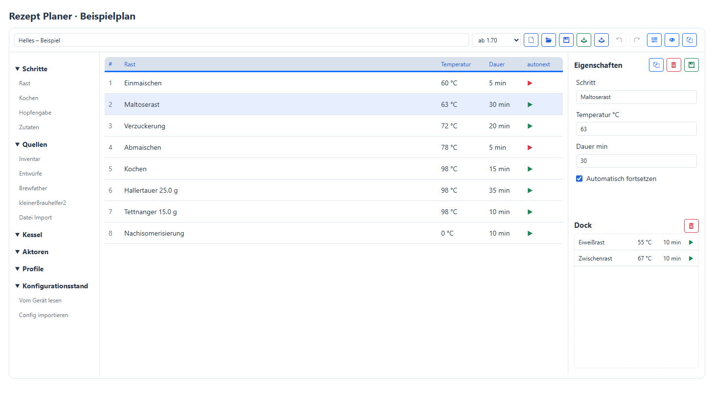
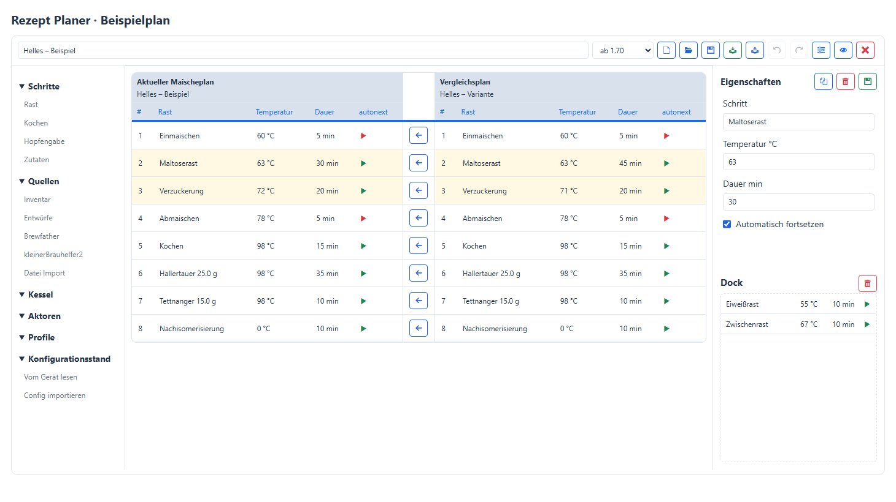
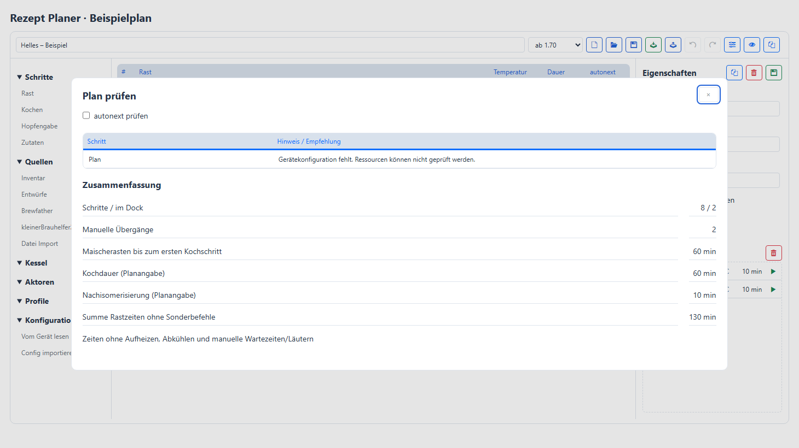

# ServiceTool-Anleitung

## Erste Schritte

Das ServiceTool verbindet deinen Computer mit einem Brautomat. Wähle zuerst das
richtige Gerät aus. Alle Geräteaktionen beziehen sich auf diese Auswahl.

### Den Brautomat verbinden

1. Schließe den Brautomat per USB an deinen Computer an.
2. Öffne **Gerät**. Wähle den COM-Port. Fehlt er in der Liste, klicke auf den
   kreisförmigen Pfeil neben der Auswahl.
3. Trage die Geräte-URL ein. Nutze die Adresse, die du für diesen Brautomat
   eingerichtet hast.
4. Klicke neben der URL auf die Verbindungsprüfung. Lies das Statusbadge oben
   rechts.

### Wo finde ich was?

- **Gerät:** Verbindung und WLAN einrichten.
- **Firmware:** Firmware installieren, Webdateien aktualisieren und die
  Websprache ändern.
- **Daten:** Pläne im Rezept Planer bearbeiten, Dateien im Explorer verwalten
  und Sicherungen bearbeiten.
- **Service:** Serial Monitor, Telegraf, Wartung, Migration und gegebenenfalls
  Test Runner.
- **Drei-Punkte-Menü:** Einstellungen, ServiceTool-Updates und diese Hilfe.

Die Hilfe öffnet das Kapitel zum aktuellen Bereich. Die Suche links durchsucht
auch die Kapiteltexte. Ein Suchbegriff wie **WLAN**, **Backup** oder
**Migration** grenzt die Kapitel ein.

### Die Kopfzeile lesen

Links wählst du das aktive Gerät. Daneben stehen COM-Port, URL und erkannte
Firmwareversion, jeweils durch einen Punkt getrennt. Rechts steht der
Verbindungs- und Prozessstatus. So kannst du vor einer Aktion kontrollieren,
welches Gerät angesprochen wird.

Das Drei-Punkte-Menü rechts oben enthält **Einstellungen**, **Auf Updates
prüfen** und **Hilfe**. Die Vor- und Zurück-Schaltflächen unten in dieser Hilfe
wechseln das Kapitel. Auf schmalen Fenstern steht die Kapitelübersicht über dem
Text.

### Zwei unterschiedliche Updates

**Firmware** aktualisiert den Brautomat. **Auf Updates prüfen** im
Drei-Punkte-Menü prüft das ServiceTool auf deinem Computer.

Weiter mit [Geräte & WLAN](#geräte--wlan).

## Geräte & WLAN

### Den Verbindungsstatus verstehen

- **Online · Kein Prozess aktiv:** Der Brautomat ist per HTTP erreichbar und
  meldet keinen aktiven Prozess.
- **Online · Prozessstatus unbekannt:** Das Gerät ist erreichbar, aber sein
  Prozesszustand konnte nicht ermittelt werden. Das bestätigt keinen
  Ruhezustand.
- **Online** mit Prozessangabe: Ein Maisch- oder Fermenterprozess wurde
  gemeldet.
- **Seriell verbunden:** Das ServiceTool hat das Gerät über USB erkannt. Das
  bedeutet nicht, dass es über WLAN erreichbar ist.
- **Kein Gerät:** Verbindung und Auswahl prüfen.

### WLAN einrichten

1. Wähle oben das gewünschte Gerät und unter **Gerät** dessen COM-Port aus.
2. Klicke im WLAN-Bereich auf den Scan-Pfeil. Warte auf das Ende des Scans.
3. Wähle dein Netzwerk aus oder trage die SSID ein. Gib das Passwort ein.
4. Klicke auf das Speichersymbol. Das Gerät übernimmt die Zugangsdaten und
   startet neu.
5. Warte den Neustart ab und prüfe die Verbindung erneut. Kontrolliere die URL,
   falls das Gerät weiterhin nur seriell erkannt wird.

**WLAN Reset** setzt die WLAN-Konfiguration zurück. Verwende diese Aktion nicht
als Ersatz für einen erneuten Scan.

### Zwischen Geräten wechseln

Die Auswahl **Aktives Gerät** schaltet das gespeicherte Paar aus COM-Port und
URL um. Ein einzelnes Profil heißt **Brautomat**. Bei mehreren Profilen heißen
sie **Master**, **worker1**, **worker2** und **worker3**.

Neue Geräte richtest du unter [Einstellungen → Geräte](#einstellungen) ein.
Während laufender Geräteaktionen kann ein Profilwechsel gesperrt sein. Warte den
Abschluss ab.

### Ein neues Gerät hat noch kein WLAN

Schließe das neue Gerät zunächst per USB an. Speichere sein Profil mit dem
erkannten COM-Port und der URL, die du für dieses Gerät verwenden möchtest.
Anschließend wählst du dieses Profil und richtest dessen WLAN ein.

Das Speichern einer URL im ServiceTool ändert nicht den Netzwerknamen des
Brautomaten. Die eingetragene Adresse muss zur tatsächlichen Gerätekonfiguration
passen. Verwende bei mehreren Geräten eindeutige Adressen.

:::details Technischer Hintergrund

Online-Erkennung und Prozessstatus stammen aus getrennten Geräteabfragen. Daher
sind Erreichbarkeit und unbekannter Prozessstatus kombinierbar. Bei mehreren
Profilen wird ein fehlender gespeicherter COM-Port nicht durch einen anderen
erkannten Port ersetzt.

:::

## Firmware

### Ein Firmwarepaket auswählen

1. Öffne **Firmware** und kontrolliere oben das aktive Gerät und dessen Version.
2. Wähle eine Paketquelle: **Latest Release** für die veröffentlichte Fassung,
   **Latest Development** für die Entwicklungsversion oder **Special Version**
   für eine bestimmte angebotene Version.
3. Bei **Special Version** wähle zusätzlich die Version. Bei **Open directory**
   wähle das lokale Paketverzeichnis.
4. Prüfe die angezeigte Paketquelle und die verfügbaren Aktionen. Fehlende
   Paketbestandteile müssen vor der Installation geklärt werden.

### Per USB installieren

1. Stelle unter **Gerät** den richtigen COM-Port ein und gehe zurück zu
   **Firmware**.
2. Wähle die Flash-Baudrate. Prüfe die Optionen **Flash löschen** und **Flash
   LittleFS** bewusst: Sie betreffen den Gerätespeicher beziehungsweise das
   Dateisystem.
3. Starte **Ausgewähltes Paket über USB installieren** und beobachte Fortschritt
   und Statusmeldung. USB und Stromversorgung während des Schreibens verbunden
   lassen.

Für den Wechsel vom alten Partitionslayout auf das ServiceApp-Layout verwende
[Migration](#migration).

### Über WLAN aktualisieren

1. Prüfe, dass das Gerät **Online** ist und keinen aktiven Prozess meldet.
2. Klicke im Abschnitt **Veröffentlichte Firmware aktualisieren** auf
   **Nach Firmware-Update suchen**. Diese Aktion sucht auf GitHub nach einer
   veröffentlichten Firmware; sie verwendet nicht das oben ausgewählte Paket.
3. Vergleiche im Dialog die aktuelle und die angebotene Firmwareversion.
4. Starte das angebotene Update erst nach dieser Kontrolle. Bei aktivem oder
   unbekanntem Prozesszustand bleibt der Start gesperrt.

### Ein heruntergeladenes ZIP verwenden

Entpacke das Firmwarepaket zuerst. Wähle **Open directory** und über das
Ordnersymbol das passende Verzeichnis mit den Firmwaredateien. Ein ZIP-Archiv
selbst ist kein Paketverzeichnis. Fehlen Dateien oder kann die Version nicht
bestimmt werden, lies die Fehlermeldung, statt Dateien verschiedener Versionen
zu mischen.

### Webdateien aktualisieren

Wähle zuerst das gewünschte Firmwarepaket. Klicke dann auf **Webdateien
aktualisieren**. Der Brautomat muss über WLAN erreichbar sein. Diese Aktion
aktualisiert die Browseroberfläche und Sprachdateien, nicht die Hauptfirmware.

Wähle dafür eine Repository-Paketquelle. Bei **Open directory** sind das
separate Webdateien-Update und die Sprachinstallation nicht verfügbar.

### Die Brautomat-Websprache ändern

Wähle unter **Brautomat Websprache** eine angebotene Sprache und klicke auf
**Sprache wechseln**. Die Sprachdateien stammen aus der ausgewählten
Paketquelle. Fehlt die Liste, prüfe Paketversion und Verbindung und beachte die
Fehlermeldung.

Die Sprache des ServiceTools selbst stellst du unter **Einstellungen** um.

:::details Paketpfade und ältere Firmware

Die Paketgeneration bestimmt die Verzeichnisse: bis einschließlich 1.66.x
wird build verwendet, ab 1.67 Updates. ServiceApp-Pakete benötigen zusätzlich
die passende
ServiceApp. Eine lokale Paketquelle muss die zusammengehörigen Dateien
enthalten.

:::

## Rezept Planer

Die Abbildungen zeigen einen Beispielplan. Klicke auf ein Bild, um es
in voller Größe in einem neuen Tab zu öffnen.

### Einen Plan bearbeiten

Öffne **Daten → Rezept Planer**. Links stehen Quellen und Bausteine, in der Mitte
liegt der ausführbare Plan. Rechts bearbeitest du den ausgewählten Schritt;
darunter liegt das **Dock**. Die Symbolbuttons zeigen beim Darüberfahren
ihre Funktion. Blau kennzeichnet Neu, Öffnen und Speichern; Grün die Übernahme
ins Inventar. Eigenschaften, Prüfen und Vergleichen verwenden ebenfalls Blau.
Deaktivierte Buttons sind hellgrau, Löschen ist rot.

1. Lade einen Plan aus einer Quelle oder beginne mit **Neuer Plan**.
2. Gib oben einen Namen ein. Die Zielgeneration **bis 1.66** oder **ab 1.70**
   wird aus der eingelesenen Konfiguration vorbelegt. Ohne Konfiguration gilt
   **ab 1.70**. Die Auswahl beeinflusst die Kompatibilitätshinweise der
   Planprüfung, nicht das Exportformat oder das Uploadziel.
3. Ziehe Bausteine, Aktoren oder Profile von links an die gewünschte Stelle.
   Ein Klick fügt ihn wie **Einf** hinter dem markierten Schritt ein; ohne
   Markierung am Ende. Bei einer Markierung im Dock wird dort eingefügt.
4. Ziehe vorhandene Schritte an eine andere Position.
5. Prüfe den Plan und speichere einen Entwurf, bevor du ihn überträgst.

**Rückgängig** und **Wiederholen** betreffen Änderungen am geöffneten Entwurf.
Sie machen weder Datei-Löschungen noch Übertragungen auf ein Gerät rückgängig.

Die Rubriken im Schnellstart lassen sich über ihre Überschrift ein- und
ausklappen, auch per Touch oder mit Enter/Leertaste. Der Zustand bleibt während
der Sitzung beim Bearbeiten und beim Sprachwechsel erhalten.

Mit **Einf** fügst du eine neue Rast hinter dem markierten Schritt ein;
ohne Markierung am Ende. **Entf** löscht markierte Tabellenzeilen. In einem
Eingabefeld bearbeitest du mit der Tastatur weiterhin dessen Inhalt.
Dialoge schließt du über das **X oben rechts**. Bei ungespeicherten
Planänderungen erscheint beim Planwechsel eine Rückfrage.

Schnellstart links, Plan in der Mitte, Eigenschaften und Dock rechts.

### Einen Plan manuell erstellen

Unter **Schritte** stehen **Rast**, **Kochen**, **Hopfengabe** und **Zutaten**.
Eine Rast lässt sich in den Eigenschaften über **Vorlage** vorbelegen, etwa
als Einmaischen, Maltoserast, Kombirast, Verzuckerung, Abmaischen oder
Nachisomerisierung. Dafür gelten **0 °C und eine Dauer größer als 0 min**.
Die Vorlage übernimmt die Nachisomerisierungsdauer aus den Maischeplan
Eigenschaften; ist diese 0, wird 1 min vorbelegt. Bei anderen Rasten bleiben
Name, Temperatur und Dauer frei bearbeitbar.

Hopfengaben bieten die Vorlagen **Hopfengabe** (Standard),
**Vorderwürzenhopfung** und **Whirlpoolhopfung**. Die Temperatur wird aus
den jeweiligen Importvorgaben übernommen. Dauer und Position bleiben erhalten.

Für Hopfengaben und Zutaten kannst du Name und Menge eingeben; bei Zutaten
zusätzlich die Einheit. **Dauer min** bleibt die Dauer des jeweiligen
Brautomat-Schritts. Die Schritte laufen in der Reihenfolge der Tabelle ab.
Es gibt keine automatische Umsortierung oder Umrechnung auf einen Zeitpunkt
vor Kochende.

Mit **Shift + Klick** markierst du einen Bereich, mit **Strg + Klick**
einzelne zusätzliche Schritte oder wählst sie wieder ab. Ziehe eine markierte
Zeile, um die gesamte Auswahl innerhalb des Plans oder ins Dock zu verschieben.
Die Reihenfolge bleibt erhalten. **Entf** oder der Löschbutton in den
Eigenschaften löscht die Auswahl. **Rückgängig** nimmt die Gruppenaktion zurück.
Die Auswahl gilt jeweils innerhalb der Plantabelle oder des Docks.

### Quellen und Einstellungen

- **Inventar:** Maischepläne im Ordner `Rezepte` und seinen
  Unterordnern. `..` führt zurück, höchstens bis `Rezepte`. Ordnerverwaltung
  erfolgt im Explorer. Andere JSON-Dateien werden hier ausgeblendet.
  Die Spaltenköpfe sortieren die Liste; Pfeile zeigen die Sortierrichtung.
- **Entwürfe:** lokal gespeicherte Arbeitsstände einschließlich Dock und
  gespeicherter Gerätekonfiguration.
- **Brewfather:** Rezepte oder Sude aus deinem Konto. Die Suche filtert die
  bereits geladenen Einträge; **Weitere laden** ruft weitere Einträge ab.
- **kleinerBrauhelfer2:** Rezepte aus der eingestellten SQLite-Datenbank, ausschließlich
  lesend.
- **Datei Import:** Öffnet direkt die Dateiauswahl. Unterstützt werden JSON-
  Exporte von Brautomat, MaischeMalzundMehr, Brewfather, kleinerBrauhelfer2 und
  ServiceTool-Entwürfe. Das Format wird automatisch erkannt. Andere JSON-Dateien
  wie Konfigurationen sind keine Rezeptdateien.
- **Pläne auf dem Gerät:** JSON-Pläne aus `/Rezepte` des aktiven Geräts.
  Die Quelle ist nur bei verfügbarer Netzwerkverbindung sichtbar. Eine
  gespeicherte Konfiguration allein ist keine Geräteverbindung.

Unter **Einstellungen → Rezeptquellen** hinterlegst du Brewfather User ID und
API Key sowie den Pfad zur KBH2-Datenbank. Der Schlüssel wird lokal gespeichert
und anschließend maskiert angezeigt. Der Löschen-Button am Schlüsselfeld
entfernt ihn. Der Speichern-Button steht oben bei Sprache und Debug-Ausgabe.

Die **Importvorgaben** legen Koch-, Abmaisch-, Vorderwürze- und
Whirlpooltemperatur fest. Diese Vorgaben
wirken beim Import, nicht nachträglich auf bereits geöffnete Entwürfe.

### Sude aus kleinerBrauhelfer2 auswählen

Wähle über **Alle**, **Rezept**, **Gebraut** und **Abgefüllt** die gewünschten
Stadien. **Merkliste** schränkt diese Auswahl auf in kbh2 vorgemerkte Sude ein;
der Filter ist zunächst ausgeschaltet. **Sude suchen** filtert zusätzlich nach
Sudname oder Sudnummer.

Die Tabelle zeigt **Sud**, **Braudatum**, **Erstellt** und **Gespeichert**.
**Gespeichert** ist das Datum der letzten Speicherung in kbh2. Ein Klick auf
einen Spaltenkopf sortiert, der Pfeil zeigt die Richtung. Ein Klick auf den
Sudnamen importiert den Sud. Die SQLite-Datenbank bleibt unverändert.

### Eigenschaften und Aktoren

Ein Klick auf eine Planzeile öffnet deren Eigenschaften: **Rast**, Temperatur,
Dauer und **Automatisch fortsetzen**. Die grüne Diskette rechts oben neben
**Eigenschaften** übernimmt die Eingabe, ohne einen Entwurf zu speichern.
In der Spalte **autonext** bedeutet der
grüne Pfeil automatisches Fortsetzen, das rote Dreieck einen manuellen
Übergang. Temperatur wird in °C, Dauer in Minuten angegeben.

Neue Aktorschritte werden mit **0 °C und 0 min** vorbelegt. Andere Werte
bleiben bearbeitbar, können aber zusätzliche Temperatur- oder Warteabläufe
auslösen. **Profilwechsel** sind dagegen fest auf **0 °C und 0 min** gesetzt.
Abweichende Werte in einem geöffneten Plan werden mit einem Hinweis korrigiert;
der Arbeitsstand gilt dann als geändert. **Automatisch fortsetzen** bestimmt
weiterhin, ob der nächste Schritt ohne Benutzerfreigabe folgt.

Bei erkannten Aktorschritten wählst du **ON** oder **OFF**. Für lokale
PWM-Aktoren steht zusätzlich **PWM %** mit ganzzahliger Leistung von 0 bis 100
zur Verfügung. Beispielsweise wird 37 % als `Ruehrwerk:37` gespeichert.
Die Konfiguration bestimmt, welche Aktoren PWM unterstützen. Ohne vollständige
Geräteinformationen müssen die Befehle gegen das Zielgerät geprüft werden.

Über **Maischeplan Eigenschaften** in der Werkzeugleiste erreichst du Kochdauer und
Nachisomerisierung. Diese Planangaben ersetzen keine Bearbeitung der einzelnen
Schritte; ihre Änderung berechnet die Schrittfolge nicht automatisch neu.

Die Planeigenschaften enthalten auch die untere und obere Temperaturgrenze
des **Enzym-Limiters**. Temperaturen werden als ganze Gradwerte übernommen.
Weicht die Summe der Kochschritte von der eingetragenen Kochdauer ab, zeigen
die Eigenschaften und **Plan prüfen** einen Hinweis. Dieser verändert den
Plan nicht. Bei Kochdauer **0** wird kein solcher Hinweis ausgegeben.

Bei eingeschalteter **Debug-Ausgabe** zeigt der separate Abschnitt **Status**
unter dem Planer die Importdaten der markierten Schritte. Mit dem roten
Papierkorb leerst du nur diese Anzeige; die Importdaten im Plan bleiben
erhalten. Das Kopieren-Symbol übernimmt den angezeigten Text in die
Zwischenablage. Beim Wechsel der Auswahl aktualisiert sich die Anzeige.

### Kessel, Profile und Befehlsnamen

Einen allgemeinen Baustein „Sonderbefehl“ gibt es nicht. Ziehe den betreffenden
Aktor, Kessel oder das Profil aus der linken Leiste in den Plan.

Bei **Kesseln** wählst du Ausgangsleistung und ON/OFF beziehungsweise 0–100 %.
Maische, Sud und HLT bieten zusätzlich **Leistung ab Übergang**. Der
Schnellstart erzeugt `MAISCHETHRESOUT`, `SUDTHRESOUT` oder `HLTTHRESOUT`.
Der Wert von 0 bis 100 % setzt die feste Kochleistung ab dem eingestellten
Übergang zum Kochen, unabhängig von der allgemeinen Leistungsbegrenzung.
Beispiel: Aufheizen mit 100 %, anschließend Kochen mit `MAISCHETHRESOUT:80`.
Der Befehl verändert und speichert die Gerätekonfiguration.
Dies setzt die Firmware-Erweiterung für den jeweiligen Kessel voraus.
Bestehende Aliase wie `IDSTHRESOUT` und `<Kesselname>THRESOUT` werden erkannt
und beim Ändern der Leistung beibehalten. Bei Auswahl der Funktion gilt
Dauer 0 min und automatisches Fortsetzen; Dauer und Aktion sind ausgeblendet.
Verfügbar sind
nur aktivierte Maische-, Sud- und Nachgusskessel. Der Fermenter gehört nicht
zu den auswählbaren Geräten eines Maischeplans.

Profile fügst du ausschließlich über **Profile** im Schnellstart hinzu.
Die Kesselfunktion bietet keinen Wechsel zu einem Profilbefehl.

Bei **Profilen** wählst du Zielkessel und Profilname. Importierte Aliase wie
`IDS`, `MLT`, `NACHGUSS`, deren Profilbefehle und konfigurierte Kesselnamen
werden erkannt. Die Anzeige bleibt an den vorhandenen Ressourcen orientiert.

Multidevice-Befehle berücksichtigen die gespeicherte Rollenzuordnung.
Remote-Aktoren erlauben derzeit nur ON/OFF, kein PWM. Nicht zugeordnete
Kessel und nicht unterstützte Remote-Kesselbefehle meldet **Plan prüfen**.
Für Remote-Kessel mit explizitem ON/OFF- oder Leistungsbefehl sind derzeit
nur die Rollen Sud und Nachguss mit Dauer 0 unterstützt.

### Das Dock verwenden

Das Dock ist eine dauerhafte Ablage für wiederverwendbare Schritte und
Sequenzen. Es bleibt beim Wechsel des Maischeplans und nach einem Neustart
erhalten. Änderungen werden automatisch lokal gespeichert.

- Aus dem Plan ins Dock ziehen **verschiebt** die ausgewählten Schritte.
- Aus dem Dock in den Plan ziehen **kopiert** sie. Die Vorlage bleibt erhalten.
- Ein Klick markiert einen Dock-Schritt. **Entf** löscht die markierten
  Schritte; mit Umschalt/Strg lässt sich eine Mehrfachauswahl bilden.
- Das Papierkorb-Icon **Dock leeren** entfernt nach einer Rückfrage den gesamten
  Inhalt. Löschen und Leeren lassen sich rückgängig machen.

Ein gespeicherter Entwurf enthält zusätzlich eine Momentaufnahme des Docks.
Beim Öffnen bleibt die aktuelle Ablage bestehen. Enthält der geladene Plan
weitere Dock-Schritte, bietet der Hinweis **Dock aus Entwurf hinzufügen** deren
Übernahme an. Bereits vorhandene identische Schritte werden berücksichtigt.
Auch beim Import nicht zugeordnete Zugaben werden auf diesem Weg angeboten.
Prüfe deren Temperatur, Dauer und Menge vor der Verwendung.

Geräte- und Ressourcenbezüge bleiben beim Kopieren erhalten. **Plan prüfen**
meldet fehlende Ressourcen im Zielplan. Das Dock wird nicht auf das Gerät
übertragen; nur die Schritte in der Plantabelle werden ausgeführt.

So übernimmst du beispielsweise eine Anfangssequenz aus Plan A in Plan B:

1. Öffne Plan A und markiere die gewünschten Schritte.
2. Ziehe sie ins Dock. Dadurch werden sie aus dem aktuellen Plan entfernt;
   speichere diese Änderung nur, wenn du auch Plan A ändern möchtest.
3. Öffne Plan B. Entscheide bei einer Rückfrage, ob du Plan A speichern willst.
4. Ziehe die Dock-Schritte an die gewünschte Stelle in Plan B. Im Dock bleiben
   sie für weitere Pläne verfügbar.

### Entwürfe, Dock und Inventar

Ein **Entwurf** ist ein Zwischenstand: Du planst, probierst Varianten aus und
parkst Schritte im **Dock**. Nur die Schritte in der Plantabelle werden später
auf dem Gerät ausgeführt. Dock, Konfiguration und Importdaten bleiben lokal.

**Entwurf speichern** bietet bei vorhandenen Entwürfen:

- **Version aktualisieren:** den geöffneten Zwischenstand überschreiben.
- **Neue Version speichern:** einen weiteren Zwischenstand behalten.
- **Als eigenständige Variante speichern:** einen unabhängigen Entwurf erzeugen.
  Gib Varianten einen unterscheidbaren Plannamen.

**Ins Inventar übernehmen** schließt den Entwurf ab. Im Dialog kannst du den
Plannamen und Zielordner wählen oder einen Ordner anlegen. Bei gleichem Namen
im selben Ordner wird standardmäßig eine neue
Inventarversion angelegt; alternativ kannst du den aktuellen Stand ersetzen.
Erst nach erfolgreicher Übernahme verschwinden der Entwurf und seine
Zwischenversionen aus **Entwürfe**. Andere Varianten bleiben erhalten.

Einzelne Dateien und Entwürfe werden direkt angezeigt. Nur bei mehreren
Versionen gibt es eine aufklappbare Gruppe. Der Pfeil zeigt deren Stände,
neueste zuerst. **Neueste** kennzeichnet den letzten Stand. Ein Klick auf den
Namen öffnet den gewählten Stand; im Explorer erscheint die Dateivorschau.
**Erstellt** und **Aktualisiert** zeigen die verfügbaren Zeitangaben. Wenn kein
Erstellungsdatum bekannt ist, steht dort **—**.
Öffnest du einen Inventarplan im Rezept Planer, entsteht ein neuer
Arbeitsstand. Die Inventardatei bleibt bis zur erneuten Übernahme unverändert.
Die Konfiguration wird wiederhergestellt; zusätzliche gespeicherte Dock-Schritte
werden zur Übernahme angeboten.
Auf das Gerät gelangt ausschließlich der ausführbare Plan.

Der rote Papierkorb löscht den gewählten Stand. Bei einer Gruppenzeile
bezieht er sich auf alle Versionen; die Rückfrage benennt diesen Umfang.
Nach einer Rückfrage wird die Auswahl gelöscht. Verbleibende Versionen werden
lückenlos neu nummeriert. Wird der aktuelle Inventarstand gelöscht, rückt die
jüngste archivierte Version nach. Kennungen bleiben dabei stabil; ein geöffneter
Entwurf wird nicht versehentlich einer anderen Version zugeordnet.
Löschen lässt sich nicht mit **Rückgängig** widerrufen.

Die Ordnerstruktur im Inventar ist frei wählbar: beispielsweise
`Brautomat32/Rezepte` oder `Rezepte/Brautomat32`. Zusätzliche Geräteordner sind
optional. Konfiguration, Profile und Fermenterpläne können entsprechend
geordnet werden. Versionen werden innerhalb ihres Ordners zusammengefasst.
Ein Maischeplan für Master und Worker bleibt ein gemeinsamer Plan beim Master.
Beim Upload wird für Maischepläne `/Rezepte/Dateiname.json` vorausgewählt;
lokale Geräteordner werden nicht auf das Gerät übertragen. Der Ordnername
ändert nicht das ausgewählte Zielgerät.
Entwürfe und ergänzende Rezept Planer-Daten liegen im Unterordner `designer` des
ServiceTool-Datenverzeichnisses. Für eine spätere Bearbeitung mit Dock und
Konfiguration müssen beide Bestände erhalten bleiben.

### Zwei Pläne vergleichen

Öffne **Maischeplan vergleichen** und wähle einen Entwurf. Über das Datei-Icon
neben der Überschrift kannst du stattdessen eine Datei wählen. Links steht
der aktuelle Plan, rechts der Vergleichsplan. Unterschiede werden zeilenweise
hervorgehoben. Sonderbefehle, die nur auf einer Seite als nächster Schritt
stehen, erhalten eine eigene Zeile ohne Vergleich. Stehen auf beiden Seiten
Sonderbefehle, werden sie miteinander verglichen. Normale Rasten werden
weiterhin in ihrer Reihenfolge verglichen; zusätzliche Rasten können die
Zuordnung verschieben. Mit dem **Pfeil nach links** zwischen den Tabellenhälften
übernimmst du einen rechten Schritt ans Ende des aktuellen Plans links.
Das rote X in der Werkzeugleiste (**Vergleich beenden**) führt zurück
zur Bearbeitung.
Anschließend kannst du ihn an die gewünschte Position ziehen.

Geänderte Schritte sind farbig hervorgehoben.

### Gerätewissen und Planprüfung

**Vom Gerät lesen** erfasst Konfiguration, Profile und verfügbare
Multidevice-Ressourcen des aktiven Geräteprofils. Der Stand wird lokal für
Offlinearbeit gespeichert. **Config importieren** liest eine lokale
Konfiguration ein; separate Profildateien und aktuelle Remote-Daten fehlen
in diesem Fall gegebenenfalls.

**Plan prüfen** gibt Hinweise, etwa zu fehlenden Ressourcen, veralteten
Konfigurationsständen, Werten, Gerätegeneration und manuellen Übergängen.
Ein Klick auf einen schrittbezogenen Hinweis wählt den Schritt aus.
Die Prüfung ändert nichts und blockiert weder Speichern noch Übertragen.
Sie ersetzt keinen Funktionstest am Zielgerät.

Mit **autonext prüfen** beziehst du auch manuelle Übergänge in die Hinweise
ein; die Checkbox ist zunächst ausgeschaltet. Die Zusammenfassung zeigt
Schrittanzahl, manuelle Übergänge und Zeitangaben. Die Zeiten enthalten kein
Aufheizen, Abkühlen oder manuelles Warten/Läutern. Bei Dekoktion ist die Zeit
bis zum ersten Kochschritt nicht die gesamte Maischedauer.

Hinweise und Zeitangaben helfen bei der Kontrolle des Plans.

### Maischepläne öffnen und übertragen

Lokale Dateien öffnest du über die Einträge unter **Quellen**.
**Maischeplan auf Gerät übertragen** schreibt den aktuellen Plan ohne Dock
nach `/Rezepte` auf dem aktiven Gerät. Eine gleichnamige Datei wird ersetzt.
Bei Multidevice erfolgt die Übertragung auf den Master. Der Maischeprozess
wird dadurch nicht gestartet. Alternativ steht der **Explorer** zur Verfügung.

## Daten

### Explorer

Unter **Inventar → Entwürfe** findest du direkt unter **Maischepläne**
deine gespeicherten Entwürfe mit ihren Versionen. Ein Klick auf einen Stand
öffnet ihn im Rezept Planer. Sortieren und Löschen funktionieren wie dort.

Öffne **Daten → Explorer**. Links wählst du das aktive Gerät oder das lokale
Inventar. Schnellzugriffe führen zu Plänen, Profilen, Konfiguration und Logs.
**Alle Dateien** zeigt das Dateisystem des gewählten Speicherorts. Der Pfad oben
zeigt deinen aktuellen Ordner; ein aktiver Filter wird daneben angezeigt.

Ein Klick wählt eine Datei und zeigt rechts die Textvorschau. Ein Klick auf den Ordnernamen
öffnet den Ordner. Die Vorschau lässt sich über das Seitenbereich-Symbol
**Vorschau** ein- und ausblenden.
Die Symbole erklären ihre Funktion per Tooltip, auch bei Tastaturfokus.

- **Inhalt kopieren** kopiert den Text in die Zwischenablage.
- **Herunterladen** speichert die Datei auf dem PC; **Hochladen** öffnet die
  Dateiauswahl des PCs.
- **Im lokalen Inventar speichern** beziehungsweise **Auf Gerät übertragen**
  fragt nach dem Zielpfad und bestätigt das Ersetzen vorhandener Dateien.
- **Bearbeiten** schaltet unterstützte Textdateien frei. Speichern prüft JSON
  und verhindert das Überschreiben einer seit dem Laden geänderten Datei.
  Wann die Firmware eine Datei übernimmt, hängt vom Dateityp ab.
- **Umbenennen** und **Löschen** betreffen die ausgewählte Datei am angezeigten
  Speicherort. Ordner können nur gelöscht werden, wenn sie leer sind.

Unter **Logs** findest du `webUpdateLog.txt` und `autotune_log.txt`.
Binärdateien und Dateien über 4 MiB kannst du herunterladen, aber nicht im
Explorer bearbeiten. Unter **Menü → Einstellungen → Lokales Inventar** wählst du
das Inventarverzeichnis. Ohne gespeicherte Auswahl gilt das Programmverzeichnis.

#### Navigation und Schnellzugriff

Die Überschriften für Gerät, **Inventar** und **Schnellzugriff** lassen sich
ein- und ausklappen. Der Zustand bleibt beim Aktualisieren erhalten.
Mit **..** gehst du einen Ordner zurück; im Stammverzeichnis entfällt dieser
Eintrag. Über die Pfadangabe kannst du übergeordnete Ordner direkt öffnen.
Im Rezept Planer endet die Navigation dagegen beim Ordner `Rezepte`.

Das **Plus** bei Schnellzugriff bindet einen vorhandenen lokalen Ordner ein.
Das Entfernen eines Schnellzugriffs löscht dessen Dateien nicht.
Neue Ordner legst du über das Ordnersymbol in der Werkzeugleiste an.
Das Inventar kannst du auch ohne erreichbaren Brautomat verwenden.
Scheitert der Gerätezugriff, prüfe unter **Gerät** die Adresse und Verbindung
und versuche es anschließend mit **Aktualisieren** erneut.

#### Ordner und Versionen im Inventar

Für ein einzelnes Gerät genügt beispielsweise `Rezepte/MeinPlan.json`.
Für mehrere Geräte funktionieren beide Strukturen:

- `worker1/Rezepte/MeinPlan.json`: zuerst nach Gerät ordnen.
- `Rezepte/worker1/MeinPlan.json`: zuerst nach Dateityp ordnen.

Ein einzelner Stand erscheint direkt als Datei. Erst mehrere Versionen bilden
eine aufklappbare Gruppe. **Erstellt** und **Aktualisiert** zeigen die
verfügbaren Datumsangaben; **—** bedeutet, dass kein Datum bekannt ist.
Der rote Papierkorb einer Version löscht diesen Stand, der einer Gruppe alle
zugehörigen Versionen. Die Rückfrage nennt den Umfang. Verbleibende Versionen
werden neu nummeriert. **Entwürfe** unter Inventar öffnet gespeicherte
Arbeitsstände im Rezept Planer, einschließlich der dortigen Dock-Funktionen.

#### Einen Inventarplan auf das Gerät übertragen

1. Wähle oben das gewünschte Zielgerät und im Inventar den Maischeplan.
2. Klicke auf **Auf Gerät übertragen**.
3. Kontrolliere Dateiname und Zielverzeichnis im Dialog.

Für Maischepläne wird `Rezepte` als Ziel vorgeschlagen. Aus
`worker1/Rezepte/MeinPlan.json` wird auf dem Gerät `/Rezepte/MeinPlan.json`.
Der lokale Geräteordner wird nicht mit übertragen und wählt auch kein Gerät
aus. Ein gemeinsamer Multidevice-Plan gehört auf den Master.
Die Übertragung startet keinen Maischeprozess.

### Konfiguration sichern und wiederherstellen

1. Öffne **Daten → Sichern & Wiederherstellen**.
2. Erstelle ein Konfigurationsbackup. Es wird lokal gespeichert und in der Liste
   angeboten.
3. Zur Wiederherstellung wähle das passende Backup oder eine externe JSON-Datei.
4. Kontrolliere vor dem Wiederherstellen das aktive Gerät und die ausgewählte
   Sicherung.

### Welche Sicherung brauche ich?

- Ein **Konfigurationsbackup** sichert die über die Backup-Funktion
  bereitgestellten Geräteeinstellungen.
- **Firmware Backup** sichert die aktive App-Partition über USB.
- Das **Migrationsbackup** sichert die Einstellungen über die Geräte-API
  und enthält zusätzlich den Migrationsbericht.

Diese Sicherungsarten sind nicht austauschbar. Für eine unterbrochene Migration
lies [Migration](#migration).

Für **Firmware Backup** verlangt die Oberfläche zusätzlich eine
Online-Verbindung. Ein gespeichertes Firmware-Image ist kein vollständiges
Backup von Einstellungen und Dateisystem.

## Service

### Serial Monitor

1. Öffne **Service → Serial Monitor**.
2. Kontrolliere Port und Baudrate und starte den Monitor.
3. Nutze die Ausgabe zur Fehlersuche. Kopiere relevante Meldungen einschließlich
   der Fehlermeldung.

Flash und Firmwarebackup benötigen den seriellen Port ebenfalls. Das ServiceTool
führt dafür eine Portübergabe durch. Beachte den angezeigten Zustand nach der
Aktion.

### Telegraf

Telegraf überträgt Gerätedaten an konfigurierte Ziele. Öffne **Service →
Telegraf**, um Programmdatei, Abrufintervall, Vorlagen und Ziele einzustellen.

1. Prüfe die bestehende Konfiguration und aktiviere nur die benötigten Ziele.
2. Trage die Zielverbindung und erforderliche Zugangsdaten ein.
3. Speichere die Konfiguration und starte Telegraf über die angebotene
   Startaktion.
4. Kontrolliere Status und Protokoll. Zum Beenden verwende die Stoppaktion.

Das Speichern von Passwörtern wird über die dafür vorgesehene Option gesteuert.
Eine laufende Telegraf-Sitzung kann einen Geräteprofilwechsel verhindern.

### Wartung

Unter **Service → Wartung** kannst du den Wartungsmodus starten beziehungsweise
beenden. Beachte Hinweise auf laufende Prozesse und auf eine blockierte
Hauptfirmware.

Wenn eine Reparatur angeboten wird, lies den angezeigten Grund und verwende den
vorgesehenen Reparaturablauf. Weitere Hinweise: [Brautomat startet
nicht](#fehlerbehebung).

### Eine blockierte Hauptfirmware reparieren

1. Lies unter **Service → Wartung** den angezeigten Grund. Die Reparatur wird
   bei unvollständig geschriebener Hauptfirmware angeboten.
2. Wähle unter **Firmware** die gewünschte Paketquelle und gegebenenfalls die
   Version aus.
3. Kehre zu **Service → Wartung** zurück und klicke auf **Hauptfirmware
   reparieren**.
4. Kontrolliere das im Bestätigungsdialog genannte Paket. Bestätige die
   Übertragung und warte auf Prüfung und Ergebnis.

Ein Zurücksetzen des Braustatus ist eine andere Aktion als die
Firmware-Reparatur. Nutze es nicht als allgemeinen Ersatz für die angezeigte
Reparatur.

### Test Runner

Dieser Bereich erscheint nur mit der erforderlichen lokalen
Entwicklungsumgebung. Für normale Wartungsaufgaben wird er nicht benötigt.

:::details Voraussetzungen für den Test Runner

Die Erkennung benötigt die Test-Automation-Dokumente, das Test-Runner-Projekt,
mindestens eine gültige Suite-Konfiguration und Node.js. Fehlen diese
Voraussetzungen, bleibt der Eintrag verborgen. Eine ausdrückliche Ausblendung
über hide_test bleibt wirksam.

:::

## Migration

Die Migration wechselt das Partitionslayout älterer Geräte auf das
ServiceApp-Layout. Sie ist mehr als ein normales Firmwareupdate.

### Voraussetzungen

Unterstützt werden Ausgangsversionen **1.62.0 bis einschließlich 1.66.x**
und Zielversionen **ab 1.67.0 mit kompatiblem ServiceApp-Layout** auf
unterstützten ESP32-Geräten mit 4 MiB Flash und altem symmetrischen Layout.
Das ServiceTool prüft das Gerät vor dem Schreiben.

### Migration durchführen

1. Beende Brau- und Fermenterprozesse. Verbinde den Brautomat per USB und stelle
   sicher, dass seine URL erreichbar ist.
2. Kontrolliere das aktive Gerät und den COM-Port unter **Gerät**.
3. Öffne **Service → Migration** und wähle Paketquelle und Zielpaket.
4. Starte die Migration. Halte USB und Stromversorgung bis zum Abschluss
   verbunden.
5. Lies das Ergebnis. Ein gestarteter Vorgang ist noch kein erfolgreicher
   Abschluss.

Zuerst wird das API-Backup gespeichert. Danach werden die neuen Images
installiert. NVS und LittleFS bleiben erhalten; Webdateien werden aktualisiert.

### Nach einem Abbruch

Beachte die angezeigte Wiederherstellungssitzung. **Migration fortsetzen** ist
möglich, wenn die benötigten Installationsdateien noch im Cache vorhanden sind.
**Restore Backup** spielt die gesicherten Einstellungen auf die installierte
Firmware zurück. Dafür muss das Gerät über seine URL erreichbar sein.
Nach einem unterbrochenen Flashvorgang zuerst die Migration fortsetzen.
Andere serielle Aktionen können bis zur Wiederherstellung gesperrt bleiben.

:::details Was wird gesichert und geprüft?

Migrationssicherungen liegen unter `backups/migrations` und enthalten
`backup.json` sowie `report.json`. Das API-Backup wird unverändert übernommen:
Konfiguration, WLAN-Zugangsdaten, Maische- und Fermenterpläne, Profile und
Logging-Einstellungen. Die Firmware ist nicht enthalten.
Es gibt keinen Flash-Lesedurchlauf; esptool prüft die geschriebenen Images.
Ältere vollständige Flash-Sicherungen bleiben über USB wiederherstellbar.
Nur diese ersetzen auch die Firmware und verwenden eine Rückleseprüfung.

:::

## Einstellungen

Öffne das **Drei-Punkte-Menü → Einstellungen**.

### Sprache und Debug-Ausgabe

Die Sprachwahl betrifft das ServiceTool. Die Websprache des Brautomaten änderst
du unter **Firmware**. Die Debug-Ausgabe blendet zusätzliche Statusinformationen
für die Fehlersuche ein.

### Ein weiteres Gerät einrichten

1. Wähle im Abschnitt **Geräte** die Aktion **Gerät hinzufügen**.
2. Wähle den COM-Port des neuen Geräts und trage seine eindeutige URL ein.
3. Speichere das Profil. Die Oberfläche wird mit dem gewählten Gerät neu
   geladen.
4. Richte bei Bedarf unter **Gerät** das WLAN ein.

COM-Port und URL sind Pflicht. Die URL muss beim Speichern noch nicht erreichbar
sein. Für das erste Gerät lautet der Standard `http://brautomat`; vorhandene
Einstellungen bleiben erhalten. Ab dem zweiten Gerät ist das URL-Feld zunächst
leer.

### Ein Profil bearbeiten oder entfernen

Wähle oben das betreffende Gerät. Unter **Einstellungen → Geräte** zeigt die
Zusammenfassung die aktuelle Auswahl. **Profil bearbeiten** öffnet dessen
COM-Port und URL.

Zusätzliche Geräte lassen sich im Profildialog entfernen. Das erste Profil
bleibt erhalten. Das Entfernen eines Profils löscht keine Daten auf dem
Brautomat.

### Das ServiceTool aktualisieren

Wähle **Drei-Punkte-Menü → Auf Updates prüfen**. Ein angebotenes Update wird als
ZIP heruntergeladen und anhand seiner Prüfsumme geprüft. Ob die Installation
automatisch erfolgen kann, zeigt der Updatedialog an. Bei unterstützter
Installation verlangt das ServiceTool eine Bestätigung, bevor es beendet,
aktualisiert und neu gestartet wird. Andernfalls wird das Paket zur manuellen
Installation bereitgestellt.

## Fehlerbehebung

### Kein COM-Port gefunden

Prüfe USB-Verbindung und Stromversorgung. Klicke unter **Gerät** neben der
Portauswahl auf den Scan-Pfeil. Bei mehreren Profilen prüfe den gespeicherten
Port unter **Einstellungen → Geräte**; ein anderes angeschlossenes Gerät wird
nicht automatisch übernommen.

### Nur seriell verbunden

Prüfe WLAN-Zugangsdaten und die für dieses Gerät eingetragene URL. Nach einem
Neustart warte auf den Verbindungsaufbau und starte die Geräteprüfung erneut.

### WLAN-Scan läuft nicht durch

Warte eine laufende Prüfung ab und wiederhole den Scan. Bei **No serial
response** prüfe den COM-Port und ob ein anderes Programm ihn verwendet. Kopiere
die genaue Statusmeldung, falls der Fehler bestehen bleibt.

### Online, aber Prozessstatus unbekannt

Starte die Geräteprüfung erneut. Der Status bedeutet, dass die Prozessabfrage
keine verwertbare Antwort geliefert hat. Er beweist weder einen laufenden noch
einen beendeten Prozess. Aktionen, die einen sicheren Ruhezustand benötigen,
können deshalb gesperrt sein.

### Brautomat startet nicht in die Hauptfirmware

Wenn die ServiceApp erreichbar ist, prüfe unter **Service → Wartung** den
angezeigten Startblocker. Wird **Hauptfirmware reparieren** angeboten, wähle
eine passende Firmwarequelle und folge diesem Ablauf. Für die Übertragung muss
das Gerät über WLAN erreichbar sein.

Ein erneutes Flashen allein beseitigt nicht jeden gespeicherten Startblocker.
Ändere dafür keine NVS-Einträge auf Verdacht. Bei einer unterbrochenen Migration
verwende die [Migrationswiederherstellung](#migration).

### Sprachdateien oder Firmwarepaket fehlen

Kontrolliere die ausgewählte Quelle. **Special Version** benötigt eine konkrete
Version. Onlinepakete benötigen eine erreichbare Paketquelle; bei lokalen
Verzeichnissen müssen die passenden Dateien vorliegen.

### Angaben für eine Fehlermeldung

- ServiceTool-Version und angezeigte Firmwareversion.
- Aktives Gerät, Verbindungsstatus und betroffene Aktion.
- Genaue Fehlermeldung sowie die relevanten Statuszeilen.

Entferne Passwörter und andere Zugangsdaten aus Texten oder Bildern, bevor du
sie weitergibst.
