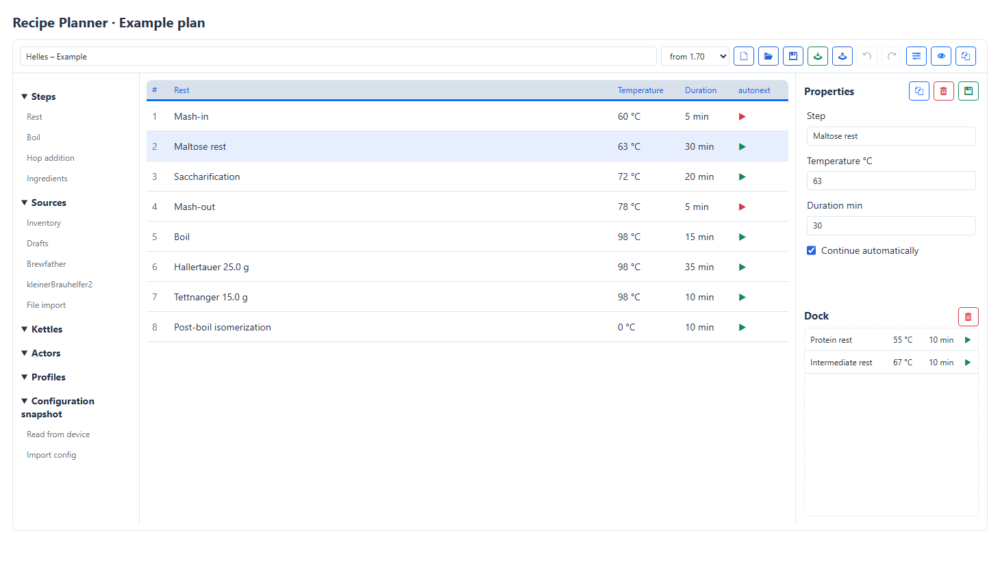
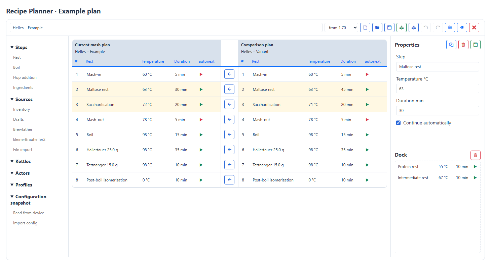
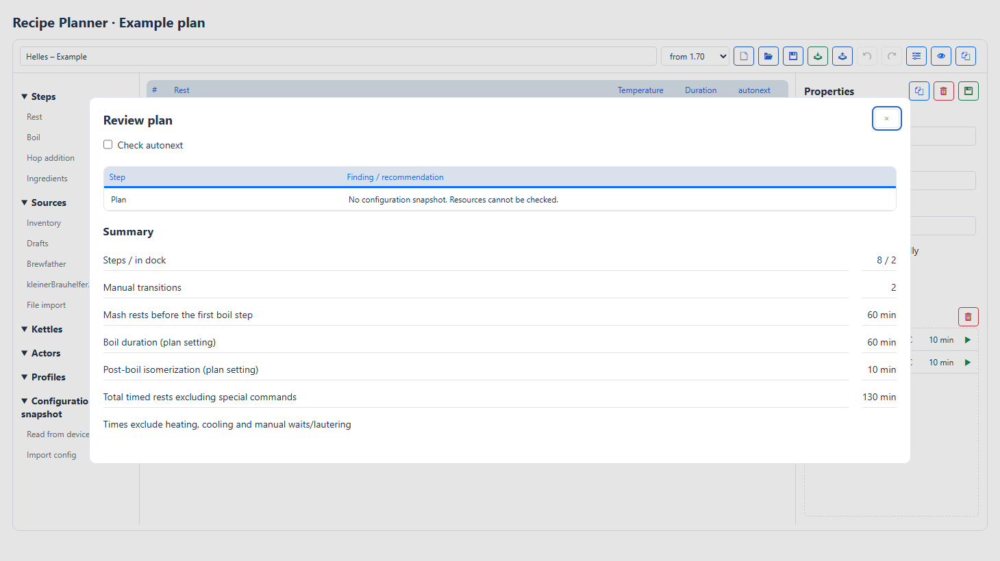

# ServiceTool guide

## Getting started

ServiceTool connects your computer to a Brautomat. Select the correct device
first: device actions apply to that selection.

### Connect a device

1. Connect the Brautomat to your computer via USB.
2. Open **Device** and select its serial port. Use the circular arrow beside the
   port list to refresh it.
3. Enter the URL configured for that Brautomat.
4. Run the connection check beside the URL and read the status at the top right.

### Find a task

- **Device:** connection and WiFi.
- **Firmware:** firmware installation, web files and device web language.
- **Data:** Recipe Planner, Explorer, backup and restore.
- **Service:** Serial Monitor, Telegraf, Maintenance, Migration and the optional
  Test Runner.
- **Three-dot menu:** Settings, Check for updates and Help.

Help opens the chapter for the current area. Search includes chapter text as
well as titles.

### Read the header

Select the active device on the left. Its serial port, URL and detected firmware
version follow, separated by dots. The connection and process status is on the
right. Check this row before running a device action.

The three-dot menu provides **Settings**, **Check for updates** and **Help**.
Use the previous and next buttons at the bottom of help to change chapters. On
narrow windows the chapter navigation appears above the article.

**Firmware** updates the Brautomat. **Check for updates** in the menu checks the
ServiceTool installation on your computer.

Continue with [Devices & WiFi](#devices--wifi).

## Devices & WiFi

### Understand the status

- **Online · No active process:** HTTP is available and the device reports no
  active process.
- **Online · Process status unknown:** the device is reachable, but its process
  state could not be determined. This does not confirm that it is idle.
- **Online** with process details: a mash or fermentation process was reported.
- **Connected via serial:** the device was detected through USB. This does not
  confirm WiFi access.
- **No device:** check the connection and selection.

### Configure WiFi

1. Select the device and its serial port under **Device**.
2. Click the scan arrow in the WiFi area and wait for completion.
3. Select a network or enter its SSID. Enter the password.
4. Click the save icon. The device saves the credentials and restarts.
5. Wait for the restart, then check the connection again. Verify the URL if only
   serial access is detected.

**WiFi Reset** resets the WiFi configuration; it is not another scan button.

### Switch devices

**Active device** switches the saved serial-port and URL pair. A single profile
is called **Brautomat**; multiple profiles are named **Master**, **worker1**,
**worker2** and **worker3**.

Add profiles under [Settings → Devices](#settings). Wait for running device
operations before switching profiles.

### A new device has no WiFi yet

Connect it through USB first. Save its profile with the detected serial port and
the URL you intend to use. Select that profile and configure its WiFi.

Saving a URL in ServiceTool does not change the Brautomat's network name. The
address must match the actual device configuration. Use distinct addresses for
multiple devices.

:::details Technical background

HTTP detection and process status use separate requests. A device can therefore
be online while its process state is unknown. With multiple profiles, a missing
saved serial port is not replaced automatically with another detected port.

:::

## Firmware

### Select a package

1. Open **Firmware** and check the active device and its reported version.
2. Choose **Latest Release**, **Latest Development**, **Special Version** or
   **Open directory**.
3. For **Special Version**, select a specific version. For **Open directory**,
   select the local package folder.
4. Check the displayed source and available actions. Resolve missing package
   files before installation.

### Install via USB

1. Select the correct port under **Device**, then return to **Firmware**.
2. Select the flash baud rate. Review **Erase Flash** and **Flash LittleFS**:
   these affect device storage and its filesystem.
3. Click **Install selected package over USB** and watch progress and status.
   Keep USB and power connected until writing has finished.

Use [Migration](#migration) when moving from the old partition layout to the
ServiceApp layout.

### Update over WiFi

1. Check that the device is **Online** and reports no active process.
2. Under **Update published firmware**, click **Check for firmware updates**.
   This checks GitHub for published firmware, independently of the selected
   package above.
3. Compare the current and offered versions in the dialog.
4. Start the offered update after reviewing them. An active or unknown process
   state prevents starting it.

### Use a downloaded ZIP

Extract the firmware package first. Select **Open directory** and use the folder
button to select the directory containing its firmware files. A ZIP archive
itself is not a package directory. If files or version information are missing,
read the error instead of mixing files from different versions.

### Update web files

Select the desired firmware package, then use the web-files update action. The
device must be reachable over WiFi. This updates browser resources and language
files, not the main firmware.

Select a repository package source for this. The separate web-files update and
language installation are unavailable with **Open directory**.

### Change the device web language

Select an available language and use **Change language**. Files come from the
selected package source. If the list is unavailable, check the package version,
connection and error message.

The language of ServiceTool itself is changed under **Settings**.

:::details Package generations

Firmware through 1.66.x uses the build directory; 1.67 and later use Updates.
ServiceApp packages also need the matching ServiceApp image. Local packages must
contain the corresponding files.

:::

## Recipe Planner

The screenshots show an example plan. Click an image to open it at full
size in a new tab.

### Edit a plan

Open **Data → Recipe Planner**. Sources and building blocks are on the left, the
executable plan is in the centre, and selected-step properties are on the
right, above the **Dock**. Hover over an icon button to see its function.
Blue marks new, open and save actions; green marks moving to the inventory.
Properties, review and comparison also use blue. Disabled buttons are
light grey; deletion is red.

1. Load a source or choose **New plan**.
2. Enter a name. The target generation **up to 1.66** or **from 1.70** is
   selected from the loaded configuration. Without a configuration it defaults
   to **from 1.70**. It affects compatibility findings in the plan review,
   not the export format or upload destination.
3. Drag steps, actors or profiles from the left to the required position.
   Clicking adds it after the selected step, or at the end if none is selected.
   Selecting a Dock step makes the Dock the insertion target.
4. Drag existing steps to reorder them.
5. Review the plan and save a draft before transferring it.

**Undo** and **Redo** apply to edits in the open draft. They do not undo file
removal or transfers to a device.

Expand or collapse quick-start sections using their headings, by touch or
with Enter/Space. Their state is retained during editing and language changes
within the current session.

**Insert** adds a rest after the selected step, or at the end when none is
selected. **Delete** removes selected table rows. Inside an input field,
the keyboard continues to edit its contents. Close dialogs with the **X at
the top right**. Switching plans prompts you if there are unsaved plan changes.

Quick start, plan table, properties and Dock at a glance.

### Create a plan manually

**Steps** offers **Rest**, **Boil**, **Hop addition** and **Ingredients**.
In a rest's properties, **Template** provides presets for mash-in, maltose
rest, single infusion, saccharification, mash-out and post-boil
isomerization. This requires **0 °C and a duration greater than 0 min**.
The template uses the post-boil duration from Mash plan properties, or 1 min
if that setting is 0. Other rests allow editing name, temperature and duration.

Hop additions offer **Hop addition** (default), **First-wort hopping**
and **Whirlpool hopping** templates. Temperature comes from the corresponding
import defaults. Duration and position remain unchanged.

Hop additions and ingredients provide name and amount fields; ingredients
also provide a unit selector. **Duration min** remains the duration of each
Brautomat step. Steps run in table order, without automatic reordering or
conversion to a time before the end of the boil.

Use **Shift + click** to select a range and **Ctrl + click** to add or remove
individual steps. Drag a selected row to move the whole selection within the
plan or into the Dock, preserving its order. **Delete** or the delete button
in properties removes the selection. **Undo** reverses the group action.
Selection is limited to either the plan or the Dock at a time.

### Sources and settings

- **Inventory:** mash plans in `Rezepte` and its subfolders.
  Use `..` to return, up to `Rezepte`. Manage folders in Explorer. Other JSON
  files are hidden here. Column headers sort the list; arrows show direction.
- **Drafts:** local working copies, including Dock and configuration snapshot.
- **Brewfather:** recipes or batches from your account. Search filters entries
  already loaded; **Load more** fetches additional entries.
- **kleinerBrauhelfer2:** recipes from the configured SQLite database, accessed read-only.
- **File import:** opens the file picker directly. Supported JSON exports include
  Brautomat, MaischeMalzundMehr, Brewfather, kleinerBrauhelfer2 and ServiceTool
  drafts. The format is detected automatically. Other JSON files, such as
  configurations, are not recipe files.
- **Device plans:** JSON plans in `/Rezepte` on the active device. This source
  is visible only with an available network connection. A saved configuration
  alone does not mean the device is connected.

Under **Settings → Recipe sources**, enter your Brewfather User ID and API Key
and the KBH2 database path. The key is stored locally and then shown masked.
The delete button beside the key removes it. **Save** is at the top, beside
the language and debug controls.

**Import defaults** set boil, mash-out, first-wort and whirlpool temperatures.
Defaults affect imports, not existing drafts.

### Select batches from kleinerBrauhelfer2

Select stages using **All**, **Recipe**, **Brewed** and **Bottled**.
**Watchlist** restricts the selected stages to batches bookmarked in kbh2;
it is initially unchecked. **Search batches** also filters by name or number.

The table shows **Batch**, **Brew date**, **Created** and **Saved**. **Saved**
is the last save date in kbh2. Click a column heading to sort; the arrow shows
the direction. Click a batch name to import it. The SQLite database stays
unchanged.

### Step and actor properties

Select a row to edit its name, temperature, duration and **Continue
automatically**. The green floppy-disk button at the top right beside
**Properties** applies the input without saving a draft. The **autonext** column
shows a green arrow
for automatic
continuation and a red triangle for a manual transition. Temperature is
in °C; duration is in minutes.

New actor steps default to **0 °C and 0 min**. Other values remain editable
but may introduce temperature or waiting stages. **Profile changes** are fixed
at **0 °C and 0 min**. Different values in an opened plan are corrected with
a notice and mark the working copy as changed. **Continue automatically**
still determines whether the next step requires user confirmation.

Recognised actor commands offer **ON** and **OFF**. Local PWM actors also
provide **PWM %**, with an integer power value from 0 to 100. For example,
37 % is stored as `Ruehrwerk:37`. Configuration determines PWM support.
Without complete device information, check commands against the target device.

**Mash plan properties** in the toolbar opens boil duration and post-boil
isomerization time. Changing this metadata does not recalculate step order
or duration automatically; edit individual steps as needed.

Plan properties also include the lower and upper temperature limits of the
**Enzyme limiter**. Temperatures use whole degrees. If the boil step total
differs from the planned boil duration, properties and **Review plan** show
an advisory note without changing the plan. A planned duration of **0**
disables this note.

With **Debug output** enabled, the separate **Status** section below the
planner shows import data for the selected steps. The red trash icon clears
only this display; source data in the plan is retained. The copy icon copies
the displayed text to the clipboard. Changing selection refreshes the display.

### Kettles, profiles and command names

There is no generic command building block. Drag the relevant actor, kettle
or profile from the sidebar into the plan.

**Kettles** offer an output limit with ON/OFF or 0–100 %. Mash, Sud and HLT
also offer **Power after boil transition**. Quick start generates
`MAISCHETHRESOUT`, `SUDTHRESOUT` or `HLTTHRESOUT`. A value of 0–100 %
sets the fixed boiling power after the configured transition to boiling,
independently of the general output limit. For example, heat at 100 % and
then boil with `MAISCHETHRESOUT:80`. This changes and saves device configuration.
This requires the firmware extension for the corresponding kettle. Existing
aliases such as `IDSTHRESOUT` and `<KettleName>THRESOUT` are recognised and
retained when editing power. Selecting the function sets duration to 0 min
and enables automatic continuation; duration and action fields are hidden.
Only enabled mash, Sud and HLT kettles are available.
The fermenter is not a selectable device for a mash plan.

Add profiles through **Profiles** in quick start. Kettle functions do not
convert a kettle step into a profile command.

For **profiles**, choose the target kettle and profile name. Imported aliases
such as `IDS`, `MLT`, `NACHGUSS`, their profile commands and configured kettle
names are recognised and associated with available resources.

Multidevice commands use the saved role assignments. Remote actors currently
support only ON/OFF, not PWM. **Review plan** reports unassigned kettles and
unsupported remote kettle commands. Explicit ON/OFF or output commands for
remote kettles currently support only the Sud and HLT roles with duration 0.

### Use the Dock

The Dock is a persistent collection of reusable steps and sequences. It stays
available when switching plans and after restarting. Changes are saved locally
automatically.

- Dragging from the plan to the Dock **moves** the selected steps.
- Dragging from the Dock to the plan **copies** them, preserving the templates.
- Click to select a Dock step. **Delete** removes the selected steps; use
  Shift/Ctrl for multiple selection.
- The **Clear dock** trash icon removes all Dock steps after confirmation.
  Deleting and clearing can both be undone.

Saved drafts also contain a Dock snapshot. Opening a draft keeps the current
Dock. If the loaded plan contains additional Dock steps, use **Add dock from
draft** in the notice to add them. Existing identical steps are accounted for.
Unmapped imported additions are offered in the same way. Check their
temperature, duration and quantity before use.

Device and resource references stay unchanged when copying. **Review plan**
reports resources missing from the target plan. Dock steps are never transferred
to the device; only the main plan is executed.

To reuse a starting sequence from plan A in plan B:

1. Open plan A and select the steps.
2. Drag them to the Dock. This removes them from the current plan; save that
   change only if you also want to change plan A.
3. Open plan B, deciding whether to save plan A if prompted.
4. Drag the Dock steps into plan B. They remain in the Dock for further plans.

### Drafts, Dock and inventory

A **draft** is work in progress. Explore variants and park unused steps in the
**Dock**. Only the steps in the main plan execute on the device. Dock contents,
configuration and import data remain local.

**Save draft** offers these choices for an existing draft:

- **Update version:** overwrite the current working version.
- **Save new version:** keep another intermediate version.
- **Save as separate variant:** create an independent draft. Give variants
  distinct plan names.

**Move to inventory** completes the draft. Change the plan name in the dialog
and choose or create the destination folder. An existing name in the same
folder creates a new inventory version by default;
alternatively, replace the current version. Only after a successful transfer
are the draft and its intermediate versions removed from **Drafts**.
Other variants are retained.

Single files and drafts are shown directly. Only multiple versions form an
expandable group. The arrow reveals all versions, newest first; **Latest** marks
the latest version. Click the name to open a version; Explorer shows its preview.
**Created** and **Updated** show available timestamps. Unknown creation dates
are displayed as **—**.
Opening an inventory plan creates a new working copy. The inventory file stays
unchanged until you move the edited plan back to inventory. Configuration is
restored from local designer storage; additional saved Dock
steps are offered for explicit import. Device exports contain
only the executable plan.

The red trash icon deletes the selected version. On a group row it deletes
all versions; confirmation explains the scope. Remaining
versions are renumbered without gaps. Deleting
the current inventory version promotes the newest archive. Stable identifiers
keep working copies associated with the correct version. File deletion cannot
be undone with **Undo**.

Inventory folders are optional. Both `Brautomat32/Rezepte` and
`Rezepte/Brautomat32` are supported. Configuration, profiles and fermenter plans
can be organised in the same way. Versions are grouped within their folder.
A master/worker mash plan remains one shared plan assigned to the master.
Mash plan uploads default to `/Rezepte/Filename.json`; local device folders
are not included. Folder names never change the selected target device.
Drafts and supporting designer data reside in the ServiceTool data directory's
`designer` subdirectory. Keep both locations to retain Dock and configuration
for future editing.

### Compare two plans

Choose **Compare mash plan** and select a draft. Alternatively, use the file
icon beside the heading to choose a file. Your plan is on the
left; the comparison plan is on the right. Differences are highlighted by row
position. A special command appearing next on only one side gets its own row
without comparison. When both next steps are special commands, they are
compared. Regular rests are still compared in sequence; additional rests can
shift their alignment. The **left arrow** between the table halves adds a right-hand
step to the end of the current plan on the left. The red X in the toolbar
(**Close comparison**) returns to editing.
You can then drag it to the required position.

Changed steps are highlighted.

### Configuration snapshots and review

**Read from device** captures configuration, profiles and available multidevice
resources for the active device profile. The snapshot is stored locally for
offline use. **Import config** reads a local configuration file; separate
profiles and current remote information may therefore be unavailable.

**Review plan** reports missing resources, old snapshots, values, target
generation and manual transitions. Click a step-specific note to select that
step. Review does not modify the plan or block saving or transfer. It does
not replace a functional test on the target device.

Enable **Check autonext** to include manual transitions in the findings;
it is initially unchecked. The summary shows step counts, manual transitions
and durations. Times exclude heating, cooling and manual waiting/lautering.
For decoction, the time before the first boil step is not the full mash time.

Findings and durations help you check the plan.

### Open and transfer mash plans

Open local files using the entries under **Sources**.
**Transfer mash plan to device** writes the current plan without the Dock
to `/Rezepte` on the active device, replacing a file of the same name.
Multidevice plans are transferred to the master. This does not start the mash
process. Alternatively, use the **Explorer**.

## Data

### Explorer

Under **Inventory → Drafts**, directly below **Mash plans**, you can
browse saved drafts and their versions. Click a version to open it in the
Recipe Planner. Sorting and deletion work as in the planner.

Open **Data → Explorer**. Select the active device or local inventory on the
left. Shortcuts lead to plans, profiles, configuration and logs. **All files**
shows the selected storage location. The path bar shows the current folder;
an active filter is displayed alongside it.

Click a file for its text preview; click a folder to open it. The
**Preview** side-pane
button toggles the preview. Hover or focus a command button for its tooltip.

- **Copy contents** copies text to the clipboard.
- **Download file** saves it to your PC. **Upload file** opens the PC file
  picker.
- **Save to local inventory** or **Transfer to device** asks for the destination
  path and confirmation before replacing an existing file.
- **Edit file** enables supported text files. Saving validates JSON and rejects
  files changed since loading. Application by firmware depends on the file type.
- **Rename** and **Delete** affect the selected storage location. Only empty
  folders can be deleted.

The **Logs** shortcut shows `webUpdateLog.txt` and `autotune_log.txt`.
Binary files and files larger than 4 MiB can be downloaded, but not edited.
Select the inventory directory under **Menu → Settings → Local inventory**.
Without a saved selection, the application directory is used.

#### Navigation and quick access

Expand or collapse the device, **Inventory** and **Quick access** sections
using their headings. Their state is retained when refreshing.
**..** goes up one folder and is hidden at the root. The path bar also opens
parent folders directly. In Recipe Planner, navigation stops at `Rezepte`.

The **plus** beside Quick access adds an existing local folder. Removing a
shortcut does not delete its files. Create new folders using the folder icon
in the toolbar. Inventory remains available without a connected device.
If device access fails, check its address and connection under **Device**,
then use **Refresh** to retry.

#### Inventory folders and versions

For a single device, `Rezepte/MyPlan.json` is sufficient. For multiple devices,
both structures work:

- `worker1/Rezepte/MyPlan.json`: organise by device first.
- `Rezepte/worker1/MyPlan.json`: organise by file type first.

A single version appears directly as a file. Multiple versions form an
expandable group. **Created** and **Updated** show available dates; **—** means
no date is known. A version's trash icon deletes that version; a group's icon
deletes all its versions. Confirmation describes the scope. Remaining versions
are renumbered. **Drafts** under Inventory opens saved working copies in Recipe
Planner, including its Dock features.

#### Transfer an inventory plan to a device

1. Select the target device at the top and the mash plan in Inventory.
2. Click **Transfer to device**.
3. Check the filename and destination folder in the dialog.

Mash plans default to `Rezepte`. A local `worker1/Rezepte/MyPlan.json` becomes
`/Rezepte/MyPlan.json` on the device. The local device folder is not copied and
does not select a device. A shared multidevice plan belongs on the master.
Transferring a plan does not start the mash process.

### Back up and restore configuration

1. Open **Data → Backup & restore**.
2. Create a configuration backup. It is saved locally and appears in the list.
3. To restore, select the appropriate backup or an external JSON file.
4. Check the active device and selected backup before restoring.

### Different backup types

- A **configuration backup** contains settings provided by the device backup
  feature.
- **Firmware Backup** reads the active app partition via USB.
- A **migration backup** contains the API settings backup and migration report.

These are not interchangeable. See [Migration](#migration) for an interrupted
migration.

The **Firmware Backup** interface also requires an online connection. The saved
firmware image is not a complete backup of settings and the filesystem.

## Service

### Serial Monitor

1. Open **Service → Serial Monitor**.
2. Check the port and baud rate, then start the monitor.
3. Use the output for diagnosis and copy relevant error messages.

Flashing and firmware backup also need the serial port. ServiceTool handles the
port handover; check the resulting state after the operation.

### Telegraf

Open **Service → Telegraf** to configure its executable, polling interval,
templates and output destinations.

1. Review the existing configuration and enable the destinations you need.
2. Enter destination settings and credentials.
3. Save the configuration and use the start action.
4. Check status and logs. Use the stop action to end the session.

The password-saving option controls whether passwords are saved. A running
Telegraf session can prevent switching device profiles.

### Maintenance

Use **Service → Maintenance** to enter or leave maintenance mode. Read warnings
about active processes or a blocked main firmware.

If a repair is offered, read its reason and follow the provided workflow. See
[Troubleshooting](#troubleshooting).

### Repair blocked main firmware

1. Read the reason under **Service → Maintenance**. Repair is offered for an
   incomplete main firmware write.
2. Select the intended package source and version under **Firmware**.
3. Return to **Service → Maintenance** and click **Repair main firmware**.
4. Review the package named in the confirmation, then confirm and wait for
   verification and the result.

Resetting brewing state is a different operation from repairing firmware. Do not
use it as a general replacement for the offered repair.

### Test Runner

This area is available only with the required local development environment.
Normal maintenance does not require it.

:::details Test Runner requirements

Detection requires the test-automation documents, the Test Runner project, at
least one valid suite configuration and Node.js. Without those prerequisites the
entry stays hidden. Explicit hiding through hide_test remains effective.

:::

## Migration

Migration changes an older device's partition layout to the ServiceApp layout.
It is more than a normal firmware update.

### Requirements

Supported source versions are **1.62.0 through 1.66.x**, targeting
**1.67.0 or newer with a compatible ServiceApp layout**, on supported ESP32
devices with 4 MiB flash and the old symmetric layout. ServiceTool checks the
device before writing.

### Run migration

1. Finish mash and fermentation processes. Connect USB and make sure the device
   URL is reachable.
2. Verify the active device and serial port under **Device**.
3. Open **Service → Migration** and select the package source and target
   package.
4. Start migration. Keep power and USB connected until completion.
5. Read the final result; starting an operation does not mean it succeeded.

The API backup is saved first. New images are then installed. NVS and LittleFS
are retained; web files are updated.

### Recover after an interruption

Follow the displayed recovery session. **Resume migration** requires the
installation files to remain in the cache. **Restore Backup** restores saved
settings to the installed firmware. The device must be reachable at its URL.
After an interrupted flash operation, resume migration first.
Other serial actions may remain blocked until recovery.

:::details Backup and verification

Migration backups are stored under `backups/migrations` and contain
`backup.json` and `report.json`. The entire API backup is kept unchanged:
configuration, WiFi credentials, mash and fermenter plans, profiles and
logging settings. Firmware is not included.
There is no flash read operation; esptool verifies written images.
Older full flash backups can still be restored over USB. Only those backups
replace firmware and use full read-back verification.

:::

## Settings

Open **Three-dot menu → Settings**.

### Language and debug output

The language setting affects ServiceTool. Change the Brautomat web language
under **Firmware**. Debug output reveals additional status information for
diagnosis.

### Add another device

1. Under **Devices**, choose **Add device**.
2. Select its serial port and enter its unique URL.
3. Save the profile. The interface reloads with that device selected.
4. Configure WiFi under **Device** if needed.

Both port and URL are required. The URL need not be reachable yet. The first
device defaults to `http://brautomat`; existing settings are preserved. Further
devices start with an empty URL field.

### Edit or remove a profile

Select the device at the top. **Settings → Devices** shows the selection. **Edit
profile** opens its port and URL.

Additional devices can be removed in the profile dialog. The first profile is
retained. Removing a profile does not delete data on the Brautomat.

### Update ServiceTool

Choose **Three-dot menu → Check for updates**. Offered updates are downloaded as
ZIP files and their checksums verified. The update dialog indicates whether
automatic installation is supported. If supported, ServiceTool asks for
confirmation before closing, updating and restarting. Otherwise it provides the
package for manual installation.

## Troubleshooting

### No serial port found

Check USB and power, then refresh the port list under **Device**. With multiple
profiles, check the saved port under **Settings → Devices**. Another connected
device is not selected automatically.

### Serial connection only

Check WiFi credentials and this device's URL. After a restart, allow time for
reconnection and run the device check again.

### WiFi scan does not finish

Wait for any current check, then retry. For **No serial response**, check the
port and whether another program is using it. Copy the exact error if the
problem persists.

### Online, but process state unknown

Run the device check again. The process request did not return a usable state.
This proves neither an active nor a finished process. Actions requiring a
confirmed idle state may remain unavailable.

### Main firmware does not boot

If the ServiceApp is reachable, read the boot-blocker message under **Service →
Maintenance**. If **Repair main firmware** is offered, select a suitable
firmware source and follow that workflow. WiFi access is required for the
transfer.

Flashing again does not necessarily clear a stored boot blocker. Do not change
NVS entries by guesswork. For an interrupted migration use [Migration
recovery](#migration).

### Missing languages or firmware package

Check the selected source. **Special Version** requires a specific version.
Online packages require access to their source; local folders must contain the
matching files.

### Report a problem

- Include ServiceTool and reported firmware versions.
- State the active device, connection status and attempted action.
- Include the exact error and relevant status lines.

Remove passwords and other credentials from text and screenshots before sharing
them.
